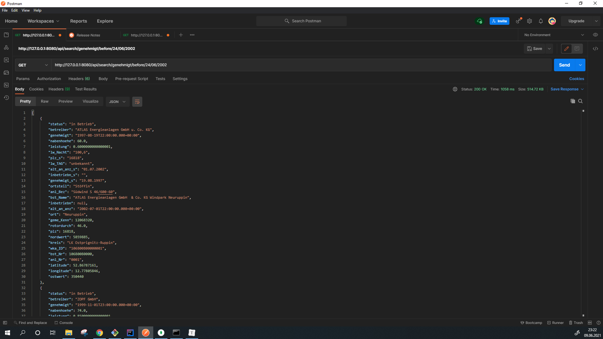

# Backend-Dokumentationen

Im Folgenden befinden sich die Dokumentationen und notwendige Anleitungen, die für das Backend dieses Projekts relevant sind. 

Für die Erstellung des Backends wurde Springboot mit Gradle verwendet. Für Unit Tests wurde JUnit in Verbindung mit AssertJ verwendet.

## Dokumentation des Datenbank-Zugriffs durch SpringBoot

Am Anfang wurde die Zugriffsdaten der MongoDB-Datenbank der Dozenten bekanntgegeben. Nur die Leseberechtigung steht zur Verfügung. Die Hauptadresse der API-Endpunkte (http://127.0.0.1:8080/api/) und die Zugangsdaten lassen sich in [application.properties](https://gitlab.rz.htw-berlin.de/s0571651/projekt-softwareentwicklung-avengers/-/blob/master/server/backend-wka/backend-wka/src/main/resources/application.properties) sehen.

Der Zugriff auf MongoDB-Datenbank-Zugriffe erfolgt durch das Framework [SpringBoot](https://spring.io/projects/spring-boot). Um Setter und Getter des Klassenmodells automatisch zu erstellen, braucht man auch die Bibliothek [Lombok](https://projectlombok.org/). Am Anfang wurde es überlegt, ob [MongoRepository](https://docs.spring.io/spring-data/mongodb/docs/current/api/org/springframework/data/mongodb/repository/MongoRepository.html) sich wegen der automatischen Anpassung nach Properties des Klassenmodells und der Verfügbarkeit von automatischen Queries für Suchfunktionen verwenden lässt. Aber es ist nicht möglich, da die Datentypen von mehreren Spalten des vorgegebenen MongoDB unterschiedlich sind (z.B: Bei der Spalte "Leistung" gibt es Integer- und String-Einträge). Dies löst sich eine Exception bei Java (nämlich: cannot parse "138,3" to String). **Erinnern Sie sich daran, dass nur die Leseberechtigung der Datenbank zur Verfügung steht und somit ist die Bearbeitung der Datenbank ausgeschlossen**!

Stattdessen wird die Bibliothek [MongoTemplate](https://docs.spring.io/spring-data/mongodb/docs/current/api/org/springframework/data/mongodb/core/MongoTemplate.html) verwendet, um die Einträge als rohe BSON-Dokumente (Eine Liste/FindIterative vom Typ Document) zugreifen kann. Dies bietet eine Möglichkeit, dass die Werte von verschiedenen Properties der BSON-Dokumente einzeln (mit try -> catch, Document.getInteger(), Document.getString(), Document.getLong(), usw.) ans festgelegte Klassenmodell angepasst werden können (z.B: Wenn der Datentyp eines Eintrags String ist (Deutsche Kommazahl), wird es mittels eines selbst definierten Algorithmus auf Integer umgewandelt; Wenn der Datumeintrag String und nicht leer ist, wird es mittels eines Algorithmus auf Date umgewandelt; usw...) ist. Der Suchalgorithmus soll dann mittels Java implementiert werden, wobei alle Einträge in einer Liste von Wka-Instanzen gestellt werden und dann, falls die Bedingung erfüllt ist, die betroffenen Einträge in der zweiten Liste gestellt werden. Die zweite Liste wird dann als Ergebnis ausgegeben (Für genauere Details der Implementation, siehe: [WkaRepository.java](https://gitlab.rz.htw-berlin.de/s0571651/projekt-softwareentwicklung-avengers/-/blob/master/server/backend-wka/backend-wka/src/main/java/com/avengers/api/repository/WkaRepository.java)).

#### **[Stand 9.06.2021]**

Das Testen erfolgt bisher mittels POSTMAN, wobei der Zugriff auf die API-Endpunkte als Frontend simuliert wird. Bisher sind die folgenden API-Endpunkte verfügbar.

- /api/raw 

  Rohe BSON-Dokumente werden zugegriffen.

  

- /api/all

  Einträge, die ans selbst definierte Klassenmodell (in Wka.java) angepasst wurden, werden zugegriffen.

  

- /api/search/lastfive

  Einträge, die ans selbst definierte Klassenmodell (in Wka.java) angepasst wurden und deren Inbetriebnahme ODER Genehmigt ODER Alt_an_anz-Datum aus den letzten 5 Jahren ist, werden zugegriffen.

  

- /api/search/ort/{ort}

  Einträge, die ans selbst definierte Klassenmodell (in Wka.java) angepasst wurden, werden nach der Eigenschaft "Ort" gefiltert.

  

- /api/search/genehmigt/before/{day}/{month}/{year}

  Die ans selbst definierte Klassenmodell (in Wka.java) angepasste Einträge, deren "**Genehmigt**"-Datum **<u>VOR</u>** dem als Parameter eingegebenen Datum liegt, werden gefiltert. 

  

- /api/search/genehmigt/on/{day}/{month}/{year}

  Die ans selbst definierte Klassenmodell (in Wka.java) angepasste Einträge, deren "**Genehmigt**"-Datum **<u>GENAU AM</u>** dem als Parameter eingegebenen Datum liegt, werden gefiltert. 

  

- /api/search/genehmigt/after/{day}/{month}/{year}

  Die ans selbst definierte Klassenmodell (in Wka.java) angepasste Einträge, deren "**Genehmigt**"-Datum **<u>NACH</u>** dem als Parameter eingegebenen Datum liegt, werden gefiltert. 

  

- /api/search/genehmigt/between/{dayMin}/{monthMin}/{yearMin}/{dayMax}/{monthMax}/{yearMax}

  Die ans selbst definierte Klassenmodell (in Wka.java) angepasste Einträge, deren "**Genehmigt**"-Datum **<u>ZWISCHEN</u>** den als Parameter eingegebenen Daten liegt, werden gefiltert. 

  

- /api/search/inbetrieb/between/{dayMin}/{monthMin}/{yearMin}/{dayMax}/{monthMax}/{yearMax}

  Die ans selbst definierte Klassenmodell (in Wka.java) angepasste Einträge, deren "**Inbetriebnahme**"-Datum **<u>ZWISCHEN</u>** den als Parameter eingegebenen Daten liegt, werden gefiltert. 

  

- /search/geninb/between/{dayMin}/{monthMin}/{yearMin}/{dayMax}/{monthMax}/{yearMax}

  Die ans selbst definierte Klassenmodell (in Wka.java) angepasste Einträge, deren "**Genehmigt**"-Datum **ODER** "**Inbetriebnahme**"-Datum **<u>ZWISCHEN</u>** den als Parameter eingegebenen Daten liegen, werden gefiltert. Die Bedingungen der Zeiträumen von "Inbetriebnahme" sind verknüpft ("**<u>ODER</u>**")

  

- /search/leistung/tag/{dayMin}/{monthMin}/{yearMin}/{dayMax}/{monthMax}/{yearMax}

  Die kumulative Leistung der verfügbaren WKAs im als Parameter gegebenen Zeitraum werden zugegriffen.

  

- /search/leistung/plz/{dayMin}/{monthMin}/{yearMin}/{dayMax}/{monthMax}/{yearMax}

  Zehn PLZ mit den meisten kumulativen Leistung  werden zugegriffen. 

  

  Wenn es weniger als 10 PLZ tatsächlich verfügbar ist, werden alle PLZ mit den meisten kumulativen Leistung zugegriffen.

  

~~Die API-Endpunkte werden im Laufe der Zeit nach dem Frontend angepasst.~~

  

## Anleitung fürs Öffnen der Projektdatei mit Intellij

1) Öffne **intellij** (nicht ein Muss, aber laut Tutorials **sehr empfehlenswert**)

2) File > Open > Wähle das Verzeichnis backend-wka (./server/backend-wka)

3) File > Invalidate all caches

4)File > Project Structure > Project > Bei Project SDK wähe ein Verzeichnis für Java SDK (Beispiel: C:\Program Files\Java\jdk1.8.0_281) 

**Achtung:** Nur Java SDK 1.8 kann verwendet werden 

5) Suche BackendWkaApplication (unter ./server/backend-wka/backend-wka/src/main/java/BackendWkaApplication). Öffne das und run!

**1.Weg**: Im <u>obigen Toolbar</u> : Run> Run BackendWkaApplication (BackendWkaApplication muss geöffnet werden)

**2.Weg**: im <u>rechten Toolbar (Project structure)</u>: Mach mal ein Rechtsklick in BackendWkaApplication > klicke "Run BackendWkaApp....main() "

**Wenn sowas im unten stehenden "Run" Terminal auftaucht:**

> **{...}**  INFO **{...}** --- [  **{...}**Main] com.avengers.api.BackendWkaApplication   : Started BackendWkaApplication in **{...}** seconds (JVM running for **{...}**)

Das ist ein gutes Zeichen. Das Backend läuft. Die API-Endpunkte können mit POSTMAN getestet werden (Adresse für API in  Postman: http://127.0.0.1:8080/api/ -> siehe: application.properties unter ./server/backend-wka/backend-wka/src/main/resources/application.properties in Server port).

~~**Wenn ihr den funktionierenden API-Endpunkt für den Zugriff auf alle DB-Einträge (/api/all) testen wollt, befindet sich der Quellcode in der vorherigen git-Version. Anleitung für die Ausführung ist wie in dieser Readme-Datei**~~

**Alle API-Endpunkte sind aktuell und können verwendet werden**

## **Bauen und Unit-Test vom Gradle-Projekt**:

Sie müssen sich **<u>im Verzeichnis "./server/backend-wka/backend-wka" befinden</u>**.

**1.Weg (Bauen+Testen auf Einmal)**: 

im **<u>Windows</u>**-Terminal: Tippen Sie:

> gradlew build

oder im **<u>Linux</u>**

> ./gradlew build

**2.Weg (<u>Separate</u> Bauen und Testen)**

Im **<u>Windows</u>**-Terminal

> gradlew assemble

und dann

> gradlew test

Oder im **<u>Linux</u>**-Terminal

> ./gradlew assemble

und dann

> ./gradlew test

Beim Unit-Test werden die Parameter bei MockHttpServlet**Request** und MockHttpServlet**Response** im Terminal bzw. CMD ausgegeben. Die zugegriffenen Einträge (Response Body) lassen sich im Parameter "Body" von MockHttpServlet**Response** betrachten.

Die Terminal-Ausgaben lassen sich auch im Build-Log von Jenkins sehen.

Genauere Infos zu den Unit-Tests befindet sich im **<u>server/backend-wka/backend-wka/build/reports/tests/test/index.html</u>**.

So sollte es aussehen:

<u>**Anmerkung zu dem Test-Logging:**</u>

Im [Abschnitt test{...} von build.gradle](https://gitlab.rz.htw-berlin.de/s0571651/projekt-softwareentwicklung-avengers/-/blob/master/server/backend-wka/backend-wka/build.gradle#L44) ist testlogging{...} so programmiert, dass die Inhalte von Standard Output (es ist im index.html zu sehen) direkt am Terminal, wo das Build und Test mit gradlew durchgeführt werden, ausgegeben werden.

Deswegen lassen sich z.B. die Benachrichtigungen für Start einer Unit-Test-Fälle, die zugegriffenen Response Bodies und ihre Anzahl direkt am Terminal betrachten.

<u>**Die Testfälle für Backend-Unit-Test:**</u>

1. **allTest()**: Der API-Endpunkt "/api/all" wird getestet. Erstens soll es sichergestellt werden, ob der HTTP-Statuscode bei dem Zugriff auf diesen API-Endpunkt 200 (OK) beträgt. Es soll auch getestet werden, ob alle 4676 Einträge der vorgegebenen Datenbank zugreifbar sind. Am Ende soll die Anzahl der durch diesen API-Endpunkt zugegriffenen Einträge durch LOG.info ausgegeben werden.
2. **genInbTest()**: Der API-Endpunkt "/api/search/geninb/between/01/04/2014/01/04/2014" wird getestet. Erstens soll es sichergestellt werden, ob der HTTP-Statuscode bei dem Zugriff auf diesen API-Endpunkt 200 (OK) beträgt. Es soll auch getestet werden, ob es nur 1 Eintrag gibt und der Inhalt (Properties) richtig bzw. wie erwartet ist. Am Ende soll die Anzahl der durch diesen API-Endpunkt zugegriffenen Einträge und der zugegriffene Eintrag (Response Body) durch LOG.info ausgegeben werden.
3. **genehmigtTest()**: Der API-Endpunkt "/api/search/genehmigt/between/01/01/2002/02/01/2002" wird getestet. Erstens soll es sichergestellt werden, ob der HTTP-Statuscode bei dem Zugriff auf diesen API-Endpunkt 200 (OK) beträgt. Es soll auch getestet werden, ob es nur 1 Eintrag gibt und der Inhalt (Properties) richtig bzw. wie erwartet ist. Am Ende soll die Anzahl der durch diesen API-Endpunkt zugegriffenen Einträge und der zugegriffene Eintrag (Response Body) durch LOG.info ausgegeben werden.
4. **inbetriebTest()**: Der API-Endpunkt "/api/search/inbetrieb/between/07/05/2003/08/05/2003" wird getestet. Erstens soll es sichergestellt werden, ob der HTTP-Statuscode bei dem Zugriff auf diesen API-Endpunkt 200 (OK) beträgt. Es soll auch getestet werden, ob es nur 1 Eintrag gibt und der Inhalt (Properties) richtig bzw. wie erwartet ist. Am Ende soll die Anzahl der durch diesen API-Endpunkt zugegriffenen Einträge und der zugegriffene Eintrag (Response Body) durch LOG.info ausgegeben werden.
5. **plzLessTest()**: Der API-Endpunkt "/api/search/leistung/plz/01/02/2002/31/02/2002" wird getestet. Erstens soll es sichergestellt werden, ob der HTTP-Statuscode bei dem Zugriff auf diesen API-Endpunkt 200 (OK) beträgt. Es soll auch getestet werden, ob es <10 Einträge gibt und der Inhalt (Properties) von allen Einträgen (Response Bodies) richtig bzw. wie erwartet ist. Am Ende soll die Anzahl der durch diesen API-Endpunkt zugegriffenen Einträge und die zugegriffenen Einträge (Response Bodies) durch LOG.info ausgegeben werden.
6. **plzTest()**: Der API-Endpunkt "/api/search/leistung/plz/01/02/2002/15/02/2003" wird getestet. Erstens soll es sichergestellt werden, ob der HTTP-Statuscode bei dem Zugriff auf diesen API-Endpunkt 200 (OK) beträgt. Es soll auch getestet werden, ob es 10 Einträge (Top 10!) gibt und der Inhalt (Properties) von allen Einträgen (Response Bodies) richtig bzw. wie erwartet ist. Am Ende soll die Anzahl der durch diesen API-Endpunkt zugegriffenen Einträge und die zugegriffenen Einträge (Response Bodies) durch LOG.info ausgegeben werden.
7. **statTagTest()**: Der API-Endpunkt "/api/search/leistung/tag/06/02/2012/10/02/2012" wird getestet. Erstens soll es sichergestellt werden, ob der HTTP-Statuscode bei dem Zugriff auf diesen API-Endpunkt 200 (OK) beträgt. Es soll auch getestet werden, ob es 5 Einträge gibt und der Inhalt (Properties) von allen Einträgen (Response Bodies) richtig bzw. wie erwartet ist. Am Ende soll die Anzahl der durch diesen API-Endpunkt zugegriffenen Einträge und die zugegriffenen Einträge (Response Bodies) durch LOG.info ausgegeben werden.

## **Ausführung vom Backend in Terminal bzw. CMD **

Außerdem steht eine Möglichkeit zur Verfügung, indem man das Backend bzw. Gradle-Projekt in Terminal bzw. CMD (**ohne Bedarf von Intellij**) ausführen kann. Dies ist sehr relevant für das Hosting der zu demonstrierenden WKA-Webseite.

#### **Schritte für die Ausführung vom Backend in Terminal bzw. CMD:**

1. Die Schritte am obigen Abschnitt ("**Bauen und Unit-Test vom Gradle-Projekt**" **-> 1.Weg oder 2.Weg**) müssen durchgeführt werden. 

   **TL;DR:** Wechsle mal in Verzeichnis "./server/backend-wka/backend-wka" -> "gradlew build" ausführen <u>ODER</u> "gradlew assemble" ("gradlew test" braucht man nicht zum Starten vom Backend) (<u>Für Linux-Systeme bitte "./" am Anfang jeder Befehle hinzufügen!</u>)

2. **Für Windows**: Führe in demselben Verzeichnis 

   > "gradlew run"

   **Für Linux**: Führe in demselben Verzeichnis 

   > "./gradlew run"

 Am Terminal bzw. CMD sollte es annähernd so aussehen.

**ACHTUNG**: Wenn alles klappt, sollte an der letzten Zeile sowas zu sehen sein:

> **{...}**  INFO **{...}** --- [ **{...}**Main] com.avengers.api.BackendWkaApplication   : Started BackendWkaApplication in **{...}** seconds (JVM running for **{...}**)

## **TODO für Backend**:

~~1) API-Endpunkte nach Frontend anpassen~~ 

2) CI für Backend

## Quellen/Referenzen für Backend:

https://javatodev.com/spring-boot-mongodb-crud-api

https://www.youtube.com/watch?v=e6NE64UFPNs

https://www.youtube.com/watch?v=Alh03DoBo3M&t=2574s

https://www.youtube.com/watch?v=lz4OX3--bOM

https://developer.mongodb.com/quickstart/java-setup-crud-operations/

https://docs.mongodb.com/guides/server/read/

https://github.com/tkgregory/spring-boot-api-example

https://stackoverflow.com/questions/3963708/gradle-how-to-display-test-results-in-the-console-in-real-time#:~:text=You%20could%20run%20Gradle%20with,test%20while%20they%20are%20running.

http://hamcrest.org/JavaHamcrest/javadoc/1.3/org/hamcrest/Matchers.html

https://stackoverflow.com/questions/46420404/spring-mockmvc-verify-body-is-empty

https://stackoverflow.com/questions/40954017/gradle-how-to-get-output-from-test-stderr-stdout-into-console

https://spring.io/guides/gs/gradle/